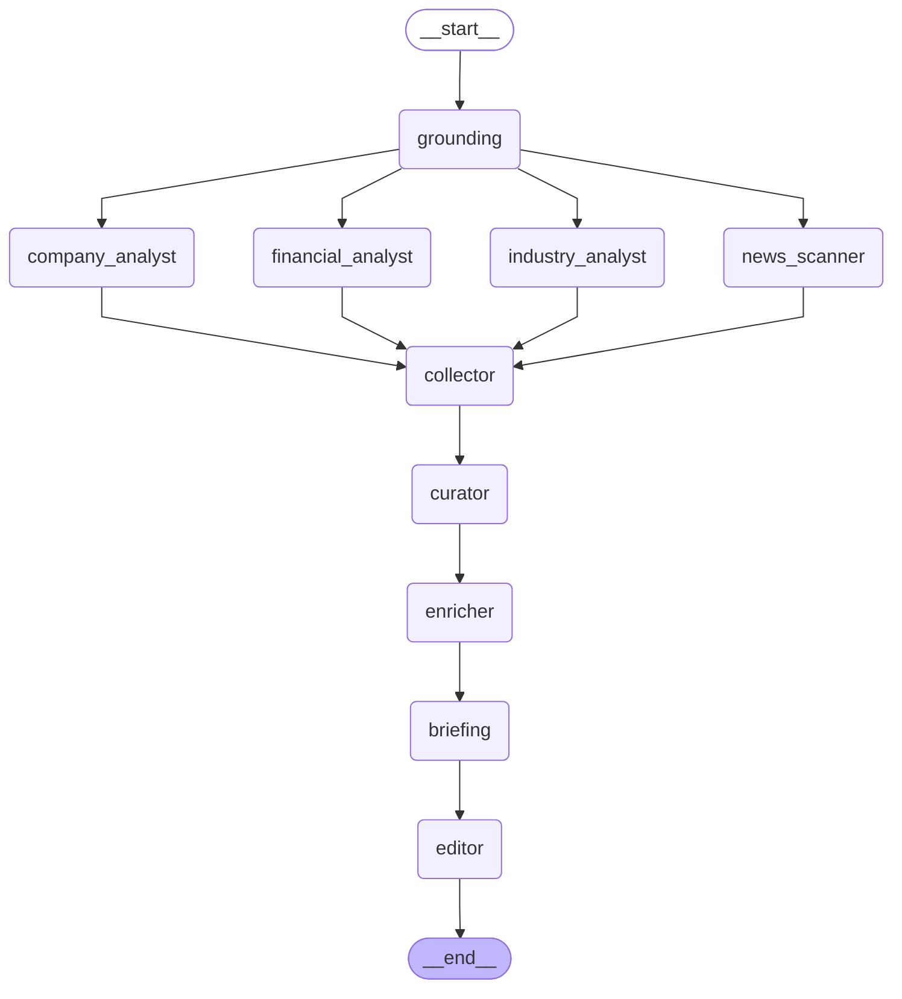

```mermaid
%%{init: {'flowchart': {'curve': 'linear'}}}%%
graph TD;
	__start__([<p>__start__</p>]):::first
	grounding(grounding)
	financial_analyst(financial_analyst)
	news_scanner(news_scanner)
	industry_analyst(industry_analyst)
	company_analyst(company_analyst)
	collector(collector)
	curator(curator)
	enricher(enricher)
	briefing(briefing)
	editor(editor)
	__end__([<p>__end__</p>]):::last
	__start__ --> grounding;
	briefing --> editor;
	collector --> curator;
	company_analyst --> collector;
	curator --> enricher;
	editor --> __end__;
	enricher --> briefing;
	financial_analyst --> collector;
	grounding --> financial_analyst;
	grounding --> news_scanner;
	grounding --> industry_analyst;
	grounding --> company_analyst;
	industry_analyst --> collector;
	news_scanner --> collector;
	classDef default fill:#f2f0ff,line-height:1.2;
	classDef first fill-opacity:0;
	classDef last fill:#bfb6fc;

```